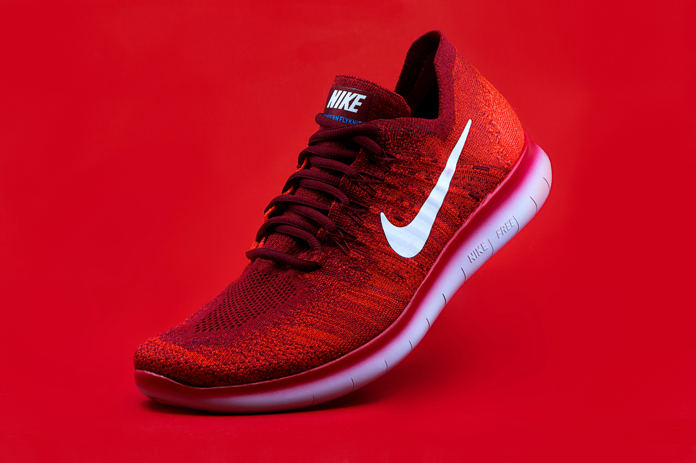

# ProductCard
# Date: 30-05-2026
# AIM:
To design and develop a Product Card for an E-Commerce Website using HTML and CSS with hover animation effects such as card movement, shadow enhancement, image zooming, and button color change.

# DESIGN STEPS:
## Step 1:
Create an HTML file named productcard.html.

## Step 2:
Define the basic HTML structure using <html>, <head>, and <body> tags.

## Step 3:
Create a folder named 'static' in the app folder.

## Step 4:
Apply CSS styling for the webpage background, card layout, rounded corners, spacing, and alignment.

## Step 5:
Use the transition property to create smooth hover animations.

## Step 6:
Increase the box-shadow property on hover to create a depth effect.

## Step 7:
Apply transform: scale() to zoom the product image on hover.

## Step 8:
Change the button background color during hover, Save the file and execute it in a web browser.

# PROGRAM:
```
<!DOCTYPE html>
<html>
<head>
    <title>Product Card Hover Effect</title>

    <style>
        *{
            margin:0;
            padding:0;
            box-sizing:border-box;
            font-family:Arial, sans-serif;
        }

        body{
            min-height:100vh;
            display:flex;
            flex-direction:column;
            justify-content:space-between;
            align-items:center;
            background:#f4f4f4;
        }

        .container{
            margin-top:50px;
        }

        .card{
            width:300px;
            background:white;
            border-radius:15px;
            overflow:hidden;
            text-align:center;
            box-shadow:0 4px 8px rgba(0,0,0,0.2);
            transition:0.4s;
        }

        .card:hover{
            transform:translateY(-10px);
            box-shadow:0 10px 20px rgba(0,0,0,0.4);
        }

        .image-box{
            overflow:hidden;
        }

        .image-box img{
            width:100%;
            height:220px;
            transition:0.4s;
        }

        .card:hover img{
            transform:scale(1.1);
        }

        .content{
            padding:20px;
        }

        .content h2{
            margin-bottom:10px;
        }

        .content p{
            margin-bottom:10px;
        }

        .price{
            font-size:22px;
            color:green;
            font-weight:bold;
            margin-bottom:15px;
        }

        button{
            padding:10px 20px;
            border:none;
            border-radius:5px;
            background:#007bff;
            color:white;
            cursor:pointer;
            transition:0.4s;
        }

        .card:hover button{
            background:#28a745;
        }

        footer{
            width:100%;
            background:#333;
            color:white;
            text-align:center;
            padding:15px;
        }
    </style>
</head>

<body>

    <div class="container">
        <div class="card">

            <div class="image-box">
                
            </div>

            <div class="content">
                <h2>Running Shoes</h2>

                <p>
                    Comfortable and stylish running shoes for daily use.
                </p>

                <div class="price">₹19,999</div>

                <button>Add to Cart</button>
            </div>

        </div>
    </div>

    <footer>
        <h3>Developed By: Anto Williams S</h3>
        <p>Register Number: 212224240012</p>
    </footer>

</body>
</html>
## OUTPUT:
image-1.png
image.png


# RESULT:
Thus, a Product Card with Hover Effect was successfully designed and implemented using HTML and CSS.
